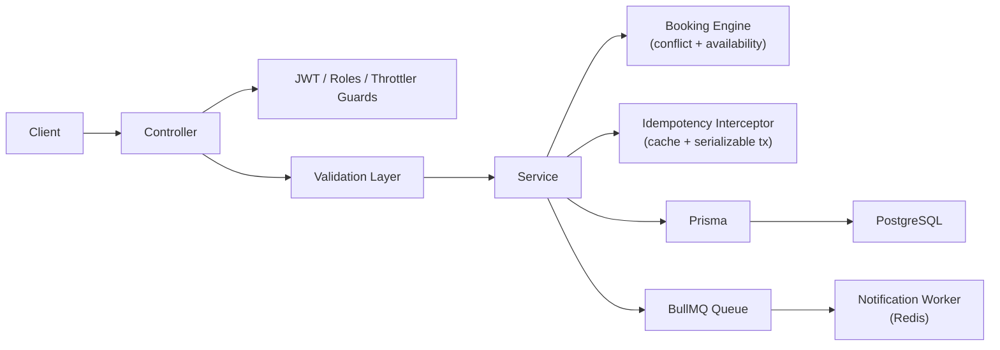

# 🗓️ Schedulify — SaaS Booking & Scheduling Backend

A production-grade NestJS 11 backend for a multi-tenant booking SaaS. Business owners define services and availability; users book time slots under strict, conflict-safe scheduling rules.

**Live API:** `https://schedulify.tmehmandoust.com/api/v1`
**Swagger Docs:** `https://schedulify.tmehmandoust.com/api/v1/docs`

---

## Highlights

- **Conflict-safe booking engine** — serializable transactions prevent double-bookings under concurrent load
- **Idempotency layer** — interceptor + serializable transaction + cache prevents duplicate resource creation across bookings, services, businesses, blocks, and working hours
- **Async notification pipeline** — BullMQ + Redis queue dispatches booking-created jobs; worker processes jobs with full lifecycle event logging
- **Multi-tier rate limiting** — short / medium / long throttle windows via `@nestjs/throttler`; stricter limits on auth endpoints
- **Security hardened** — Helmet, JWT with refresh token rotation, bcrypt password hashing, role-based guards
- **Fully Dockerized** — dev and production environments with PostgreSQL, Redis, and the app service containerized
- **Prisma migrations** — schema managed via Prisma migration files

---

## Tech Stack

| Layer           | Technology                                          |
| --------------- | --------------------------------------------------- |
| Framework       | NestJS 11 (modular monolith)                        |
| Database        | PostgreSQL + Prisma ORM (with migrations)           |
| Cache / Queue   | Redis — `@nestjs/cache-manager` + BullMQ            |
| Auth            | JWT + Passport (local, jwt, jwt-refresh strategies) |
| Notifications   | BullMQ worker + queue (booking-created jobs)        |
| Validation      | class-validator / class-transformer + zod           |
| Date / Timezone | Luxon                                               |
| Security        | Helmet, `@nestjs/throttler` (multi-tier), bcrypt    |
| API Docs        | Swagger / OpenAPI via `@nestjs/swagger`             |
| Infra           | Docker Compose (dev + prod), PostgreSQL, Redis      |

---

## Architecture Overview

```
Client
  └─► Controller (Guards: JWT, Roles, Throttler)
        └─► DTO Validation Layer
              └─► Service Layer
                    ├─► Booking Engine (conflict checks, availability, timezone)
                    ├─► Idempotency Interceptor (cache + serializable tx)
                    └─► Prisma (PostgreSQL)
                          └─► Notification Queue (BullMQ → Redis)
                                └─► Notification Worker
```



---

## Project Structure

```text
src/
├── auth/              # JWT auth, refresh tokens, Passport strategies, guards
├── users/             # User profiles, roles
├── businesses/        # Business creation + management
├── services/          # Services offered by businesses
├── bookings/          # Booking engine — core conflict + scheduling logic
├── working-hours/     # Weekly schedule system
├── blocks/            # Availability blocks / constraints
├── notifications/     # BullMQ queue, worker, service (booking-created jobs)
│   ├── notification.module.ts
│   ├── notification.queue.ts    # enqueueBookingCreated
│   ├── notification.service.ts  # job processor (logs + dispatches)
│   └── notification.worker.ts   # worker lifecycle event listeners
├── resource/          # Shared authorization logic
├── generated/prisma/  # Prisma client + generated models
├── _core/             # Decorators, interceptors (idempotency, transform), filters, utils
├── prisma.service.ts
├── app.module.ts
└── main.ts
```

---

## Core Domain Model

**Entities:** User · Business · Service · Booking · WorkingHours · AvailabilityBlock

**Key relationships:**

- `User` → owns `Business` (BUSINESS_OWNER role)
- `Business` → has many `Services`
- `Business` → has `WorkingHours` (weekly schedule) + `AvailabilityBlock`s
- `Service` → defines booking duration (minutes) + price (cents)
- `Booking` → belongs to `User` + `Business` + `Service`

---

## Booking Engine

All booking logic is enforced at the service layer with database-level safety:

| Rule                | Detail                                                                                           |
| ------------------- | ------------------------------------------------------------------------------------------------ |
| No overlap          | `CONFIRMED` bookings cannot overlap for the same business; enforced via serializable transaction |
| Working hours       | Booking must fall within the business's weekly schedule for that weekday                         |
| Time resolution     | Start time must align to 5-minute boundaries                                                     |
| Duration            | `endTime = startTime + service.durationMinutes`                                                  |
| Cancellation cutoff | Configurable threshold — only allowed before `startTime - N minutes`                             |
| Ownership           | USER cancels own bookings only; OWNER manages their business's bookings only                     |
| Timezone            | Each business stores its timezone; all scheduling logic is timezone-aware via Luxon              |

---

## Idempotency

A global interceptor guards the following mutation endpoints against duplicate requests:

- `POST /bookings`
- `POST /businesses`
- `POST /businesses/:id/services`
- `POST /businesses/:id/blocks`
- `PUT /businesses/:id/working-hours`

**How it works:** the interceptor checks an idempotency key (request header) against `@nestjs/cache-manager` (Redis-backed). On a cache miss, the operation runs inside a serializable transaction and the response is cached. Subsequent requests with the same key return the cached response immediately, preventing double-writes.

---

## Notification Pipeline

Booking-created events are dispatched asynchronously via BullMQ:

1. `BookingsService` enqueues a job via `notification.queue.ts` (`enqueueBookingCreated`)
2. `notification.worker.ts` picks up the job, processes it, and logs all worker lifecycle events (active, completed, failed, stalled)
3. `notification.service.ts` handles the job payload (currently logs `"sending booking notification"` — ready to wire to email/push/SMS)

---

## Rate Limiting

Multi-tier throttling via `@nestjs/throttler`:

| Tier   | Env var (TTL / Limit)                           |
| ------ | ----------------------------------------------- |
| Short  | `THROTTLE_SHORT_TTL` / `THROTTLE_SHORT_LIMIT`   |
| Medium | `THROTTLE_MEDIUM_TTL` / `THROTTLE_MEDIUM_LIMIT` |
| Long   | `THROTTLE_LONG_TTL` / `THROTTLE_LONG_LIMIT`     |

Auth controller has a dedicated, stricter throttle configuration applied at the controller level.

---

## API Reference

**Base prefix:** `/api/v1`
**Swagger UI:** `/api/v1/docs` (Bearer auth supported)

### Auth

```
POST   /auth/sign-up
POST   /auth/sign-in
POST   /auth/refresh
POST   /auth/sign-out
```

### Users

```
GET    /me
```

### Businesses

```
POST   /businesses
GET    /businesses
GET    /businesses/my
GET    /businesses/:id
GET    /businesses/:id/services
GET    /businesses/:id/services/:serviceId/availability
GET    /businesses/:id/bookings
POST   /businesses/:id/blocks
```

### Services

```
POST   /businesses/:id/services
GET    /services
GET    /services/:id
PATCH  /services/:id
DELETE /services/:id
```

### Working Hours

```
PUT    /businesses/:id/working-hours
GET    /businesses/:id/working-hours
```

### Bookings

```
POST   /bookings
GET    /bookings/me
GET    /businesses/:id/bookings
POST   /bookings/:id/cancel
```

### Availability Blocks

```
DELETE /blocks/:id
```

---

## Authentication

- JWT access token + refresh token rotation
- Passport strategies: `local`, `jwt`, `jwt-refresh`
- Role-based access control via NestJS guards (`USER`, `BUSINESS_OWNER`)

---

## Validation & Error Handling

- DTO validation via `class-validator` + `class-transformer`
- Custom decorators: ISO datetime, time-range, duplicate-day prevention
- Global exception filter — structured, consistent error responses
- Global response transform interceptor — consistent API shape

---

## Docker Setup

Both dev and production environments are fully containerized.

**Services in compose:**

- PostgreSQL
- Redis
- Application (NestJS)

```bash
# Development
docker compose -f docker-compose.dev.yml up -d

# Production
docker compose -f docker-compose.prod.yml up -d
```

---

## Running Locally

```bash
npm install
docker compose up -d       # starts PostgreSQL + Redis
npx prisma migrate deploy  # run migrations
npm run start:dev
```

---

## Environment Variables

```dotenv
POSTGRES_DB=
POSTGRES_USER=
POSTGRES_PASSWORD=
POSTGRES_HOST=
POSTGRES_PORT=

REDIS_HOST=
REDIS_PORT=
REDIS_URL=
REDIS_PASSWORD=

JWT_ACCESS_TOKEN_SECRET=
JWT_REFRESH_TOKEN_SECRET=
JWT_ACCESS_TOKEN_EXPIRATION_MS=
JWT_REFRESH_TOKEN_EXPIRATION_MS=
BCRYPT_SALT_ROUNDS=

THROTTLE_SHORT_TTL=
THROTTLE_SHORT_LIMIT=
THROTTLE_MEDIUM_TTL=
THROTTLE_MEDIUM_LIMIT=
THROTTLE_LONG_TTL=
THROTTLE_LONG_LIMIT=

PORT=
NODE_ENV=

DATABASE_URL=
```

---

## Known Limitations / In Progress

- Notification delivery is scaffolded (logs only) — email/push not yet connected
- No WebSocket real-time events yet (planned)
- No unit or integration tests yet (booking conflict engine is isolated and ready to test)
- No tenant-level DB isolation (multi-business separation is logical, not physical)
- No production structured logging with request IDs yet

---

## Design Philosophy

- **Deterministic booking logic** — every edge case in the conflict engine is explicit and tested at the service layer
- **Strict API boundaries** — all input validated before touching business logic
- **Reliability by design** — serializable transactions + idempotency keys make mutations safe under concurrency
- **Async by default** — side effects (notifications, future reminders) are decoupled via queue
- **Built to scale** — architecture is ready for multi-tenant evolution, payment integration, and real-time events
