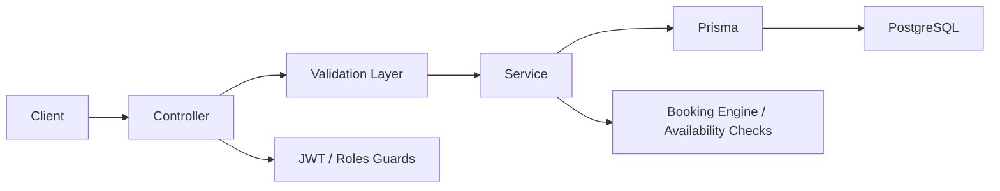

# 🗓️ Schedulify - SaaS Booking & Scheduling Backend

A NestJS 11 backend for a multi-tenant booking SaaS system where business owners define services and availability, and users book time slots under strict scheduling rules.

The system enforces conflict-free bookings, working-hour constraints, and timezone-aware scheduling logic on top of a PostgreSQL + Prisma architecture.

## Features

- JWT authentication with refresh token support (access + refresh flow)
- Role-based system (USER, BUSINESS_OWNER) with guarded endpoints
- Multi-business system (users can create and manage businesses)
- Service management per business (duration-based booking units, specified price in cents)
- Strict booking engine with conflict detection and time-rule validation:
  - No overlapping confirmed bookings per business
  - Working-hours enforcement per weekday
  - Time resolution enforced (5-minute boundaries)
  - Duration-based booking end-time calculation
  - Timezone-aware scheduling per business
- Business working hours configuration (weekly schedule system)
- Booking lifecycle management (create, cancel, ownership rules)
- Prisma-powered PostgreSQL schema with generated models
- DTO-based validation layer using class-validator + zod hybrid usage
- Global request/response transformation interceptor
- Centralized exception filtering with structured error output
- Modular architecture (feature-based NestJS modules)

## Tech Stack

- NestJS 11 (modular monolith architecture)
- PostgreSQL + Prisma ORM
- JWT + Passport (local, JWT, refresh strategies)
- bcrypt for password hashing
- class-validator / class-transformer
- zod
- Luxon for timezone + date handling
- Docker Compose for local dev environment
- Swagger / OpenAPI via `@nestjs/swagger `

## Architecture Overview

### Core Flow:

- Controller receives request
- DTO validation layer enforces schema correctness
- Service layer handles business rules (booking engine, ownership, availability checks)
- Prisma service interacts with PostgreSQL
- Response transformed via global interceptor



## Project Structure

```text
.
+- src/
├── auth/                # JWT auth, refresh tokens, strategies, guards
├── users/               # user profiles, roles
├── businesses/          # business creation + management
├── services/            # services offered by businesses
├── bookings/            # booking engine (core logic)
├── working-hours/       # weekly schedule system
├── blocks/              # availability blocks / constraints
├── resource/            # shared authorization logic
├── generated/prisma/    # Prisma client + models
├── _core/               # decorators, interceptors, filters, utils
├── prisma.service.ts
├── app.module.ts
└── main.ts
+- package.json
+- package-lock.json
+- README.md
```

## 🧾 Core Domain Model

- Main Entities
  - User
  - Business
  - Service
  - Booking
  - WorkingHours
  - AvailabilityBlock
- Key Relationships
  - User → owns Business (BUSINESS_OWNER role)
  - Business → has many Services
  - Business → has WorkingHours (weekly schedule)
  - Service → defines booking duration
  - Booking → belongs to User + Business + Service

## 📘 API Documentation

Swagger/OpenAPI documentation is configured using ` @nestjs/swagger`.

After starting the server, open:

```text
http://localhost:{port}/api/v1/docs
```

Features:

- Interactive endpoint testing
- Bearer token authentication support
- DTO schema visualization
- Request/response models

## 📡 API Overview (REST, versioned)

Base prefix:

```text
/api/v1
```

Swagger documentation available at:

```text
 /api/v1/docs
```

Bearer authentication is supported directly from the Swagger UI.
Auth

- POST /auth/sign-up
- POST /auth/sign-in
- POST /auth/refresh
- POST /auth/sign-out

Users

- GET /me

Businesses

- POST /businesses
- POST /businesses/:id/services
- POST /businesses/:id/blocks
- GET /businesses
- GET /businesses/:id
- GET /businesses/:id/services
- GET /businesses/my
- GET /businesses/:id/services/:id/availability
- GET /businesses/:id/bookings

Services

- POST /businesses/:id/services
- GET /services
- GET /services/:id
- PATCH /services/:id
- DELETE /services/:id

Working Hours

- PUT /businesses/:id/working-hours
- GET /businesses/:id/working-hours

Bookings

- POST /bookings
- GET /bookings/me
- GET /businesses/:id/bookings
- POST /bookings/:id/cancel

Availability Blocks

- DELETE /blocks/:id

-

## 🧩 Booking Engine Rules

Booking logic is strictly enforced at service layer level:

- No overlap rule
- CONFIRMED bookings cannot overlap for the same business
- Working hours validation
- Bookings must fall inside business weekly schedule
- Time resolution
- Start time must align to 5-minute increments
- Duration rule
- End time = start + service duration
- Cancellation policy
- Allowed only before cutoff (configurable threshold)
- Ownership rules
- USER: can only cancel own bookings
- OWNER: can only manage their business bookings
- Timezone handling
- Each business stores its own timezone
- All scheduling logic respects that timezone

## 🧱 Prisma + Database

- PostgreSQL database
- Prisma schema-based migrations (not yet implemented in repo state)
- Generated client under src/generated/prisma

⚠️ Note:

- No migrations setup yet (schema currently evolving manually)
- No tenant isolation at DB level yet

## 🐳 Docker Setup

Docker Compose is used for local development.

Includes:

- PostgreSQL
- Application service

## 🔐 Authentication

- JWT access token
- Refresh token flow implemented
- Passport strategies:
  - local
  - jwt
  - jwt-refresh
- Role-based access control via guards

## 📊 Validation & Error Handling

- DTO validation using class-validator
- Custom decorators:
  - ISO datetime validation
  - time range validation
  - duplicate day prevention for working hours
- Global exception filter standardizes error responses
- Response transformation interceptor ensures consistent API shape

## 🧪 Testing Status

- No tests implemented yet
- Booking logic is designed to be unit-testable (conflict engine is isolated)
- No integration/E2E coverage currently

## 🚧 Known Limitations

- No email/notification system yet
- No background jobs (no queue, no cron)
- No rate limiting on auth endpoints
- No database migrations system yet
- No tenant-level isolation (multi-business separation is logical, not physical)
- No production logging strategy yet (basic logging only)

## 📦 Environment Variables

Example configuration:

```text
POSTGRES_DB=postgres_db
POSTGRES_USER=postgres_user
POSTGRES_PASSWORD=postgres_password
POSTGRES_HOST=postgres_host
POSTGRES_PORT=postgres_port

JWT_ACCESS_TOKEN_SECRET=jwt_access_token_secret
JWT_REFRESH_TOKEN_SECRET=jwt_refresh_token_secret
JWT_ACCESS_TOKEN_EXPIRATION_MS=jwt_access_token_expiration_ms
JWT_REFRESH_TOKEN_EXPIRATION_MS=jwt_refresh_token_expiration_ms
BCRYPT_SALT_ROUNDS=bcrypt_salt_rounds

PORT=port
NODE_ENV=node_env

DATABASE_URL="postgresql://${POSTGRES_USER}:${POSTGRES_PASSWORD}@${POSTGRES_HOST}:${POSTGRES_PORT}/${POSTGRES_DB}?schema=public"

```

## 🚀 Running the Project

```text
npm install

docker compose up -d

npm run start:dev
```

## 📌 Design Philosophy

This project prioritizes:

deterministic booking logic

- strict validation at API boundaries
- separation of domain modules
- future extensibility for SaaS scaling (multi-tenant evolution, queues, notifications, payments)
